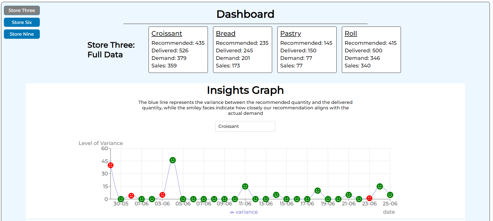

# Reporting View - Software Challenge

## Live Demo

Check out the live demo [here](https://main--deft-biscotti-d2c87a.netlify.app/).

## Technologies Used

- **React**: For its component-based architecture.
- **TypeScript**: For improved code quality and maintainability.
- **Redux Toolkit**: Managed application state efficiently while allowing it to scale up in the future.
- **Styled-Components**: For a dynamic theme and basic design system.
- **Vite**: A fast build tool for development.
- **Vitest**: Testing framework used for comprehensive testing of the application.

## Future Improvements

If I had more time, here are some improvements I would consider:

- Add more unit and integration tests to ensure code reliability.
- Implement React Server Components for enhanced server rendering and faster loading.
- Utilize the "date-fns" library and the "getWeek" function for date filtering by weeks.
- Make the design responsive to improve usability on various devices.
